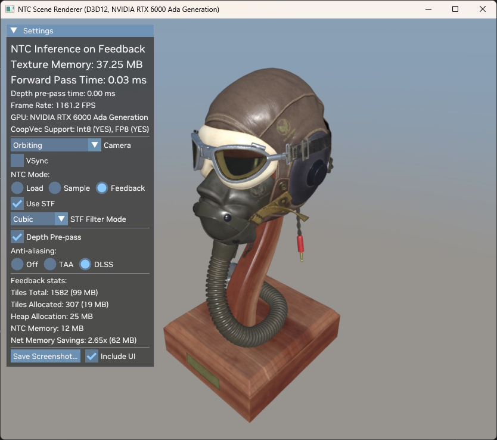

# NTC Renderer

The Renderer is a sample application that loads a [glTF](https://www.khronos.org/gltf/) model with materials pre-converted into NTC texture sets, and renders that model using either Inference on Sample or Inference on Load with optional transcoding into BCn.




## Model Preparation

The SDK includes a copy of the [FlightHelmet model](https://github.com/KhronosGroup/glTF-Sample-Assets/tree/main/Models/FlightHelmet) from the [Khronos glTF Sample Assets repository](https://github.com/KhronosGroup/glTF-Sample-Assets/) that can be found in [`assets/models/FlightHelmet`](/assets/models/FlightHelmet). The provided model comes with pre-compressed NTC materials, and the Renderer will load it when launched with no arguments for a smooth first run experience.

In order to use the Renderer with other models, you'll need to prepare the model's material files first. For that, you'll need Python 3.11 with [Pillow](https://python-pillow.org/) installed, and a glTF model. The model should be in the "glTF separate" format (a plain-text `.gltf` file with separate texture files) for the preparation script to work. We'll be using the same FlightHelmet model as an example here.

Open a command line in the `assets/models/FlightHelmet` folder in the SDK and run one of the following commands, assuming that `$NTC_SDK_PATH` is the path where the NTC SDK is located.

```sh
# For compression with a fixed BPP use:
python $NTC_SDK_PATH/support/tools/convert_gltf_materials.py FlightHelmet.gltf --bitsPerPixel 4.0 --output .
# Alternatively, for adaptive compression use:
python $NTC_SDK_PATH/support/tools/convert_gltf_materials.py FlightHelmet.gltf --targetPsnr 35.0 --output .
```

The script should take a few minutes to run, and it will create `*.ntc` files for each material used in the model, such as `FlightHelmet/GlassPlasticMat.ntc`. It will also create `*.ntc-materials.txt` files for each GLTF input file, and these files define the mapping of GLTF materials (by index) to NTC files - which is useful in case there are duplicate materials in a scene consisting of multiple GLTF files. The `.ntc` and `.ntc-materials.txt` files are what the Renderer needs. During its operation, the script also creates `*.manifest.json` files for each material, and they're deleted later, but can be kept if the `--keepManifests` argument is specified.

The aforementioned files are created in the directory specified in the `--output` argument, just `.` in the example above. If that directory matches the location of the source GLTF file(s), the Renderer should pick up the NTC files automatically. If the directory is different, its path needs to be specified as `--materialDir <path>` to the Renderer.

The `--bitsPerPixel <bpp>` script argument can be used to control the compression quality and directly translates to the `ntc-cli`'s `--bitsPerPixel` argument. Similar,y, the script supports the `--targetPsnr` argument for adaptive compression, along with `--maxBitsPerPixel <bpp>`.

Another useful argument is `--skipExisting` which will prevent the script from updating materials that already have an `.ntc` file, in case the previous conversion process was terminated prematurely.

The script implements a hardcoded mapping of various material textures to NTC channels and BCn formats for transcoding. The mapping is as follows:

| Texture                | Channels   | BC format | Notes                                                          |
|------------------------|------------|-----------|----------------------------------------------------------------|
| (a) BaseColor          | 0-2 or 0-3 | BC7       | For materials with `pbrMetallicRoughness` model                |
| (a) MetallicRoughness  | 4-5        | BC5       | For materials with `pbrMetallicRoughness` model                |
| (b) DiffuseColor       | 0-2 or 0-3 | BC7       | For materials with `KHR_materials_pbrSpecularGlossiness` model |
| (b) SpecularGlossiness | 4-7        | BC7       | For materials with `KHR_materials_pbrSpecularGlossiness` model |
| Normal                 | 8-10       | BC7       |                                                                |
| Occlusion              | 11         | BC4       |                                                                |
| Emissive               | 12-14      | BC7       |                                                                |
| Transmission           | 15         | BC4       |                                                                |

## Running the Renderer

The Renderer needs the path to the processed glTF model as a command line argument, like so:

```sh
ntc-renderer <path/to/model.gltf>
```

By default, it should load the model with NTC materials and display it in the Inference on Sample mode, with a runtime option to switch to material textures transcoded to BCn on load. Either mode can be disabled through the command line to speed up loading and/or reduce memory consumption, using the `--no-...` arguments.

```sh
--no-inferenceOnLoad    # disables texture transcoding on load
--no-inferenceOnSample  # disables the Inference on Sample mode
--no-blockCompression   # disables BCn encoding on load, decompressed textures will be kept uncompressed
--no-coopVec            # disables all CoopVec features
--no-coopVecInt8        # disables the Int8 CoopVec features
--no-coopVecFP8         # disables the FP8 CoopVec features
--referenceMaterials    # disables NTC and loads the model with its original materials instead
```

Other supported command line arguments are:
```sh
--dx12               # switches to DX12 (only available on Windows when both Vulkan and DX12 backends were built)
--debug              # enables the validation layers or debug runtime
--adapter <n>        # sets the graphics adapter index
--materialDir <path> # loads the NTC material files from a custom location instead of next to GLTF files
```

## Renderer UI and Options

At the top of the Renderer dialog, there are some information lines that show the current rendering mode, memory footprint, and performance numbers. The memory footprint is calculated for the currently used rendering mode, so it will change when switching between Inference on Sample and On Load modes. In the sample app, both versions of the materials are loaded to the GPU to allow for runtime switching, unless one of the `--no-...` options was specified.

The `Camera` box allows you to switch between orbiting and first-person cameras, and any cameras specified in the model file.

The `Filter Mode` box changes the filter used by the Stochastic Texture Filtering logic and only applies to the Inference on Sample mode. STF is not implemented for the On Load or Reference Materials mode.

The `Save Screenshot` button will save the current rnedered image into a file. The file type is determined by the provided extension; `.bmp`, `.png`, `.jpg` and `.tga` images are supported.

## Source Code

Material loading and transcoding happens in [`NtcMaterialLoader.cpp`](/samples/renderer/NtcMaterialLoader.cpp). Inference on Sample happens in [`NtcForwardShadingPass.hlsl`](/samples/renderer/NtcForwardShadingPass.hlsl) and it CoopVec/Slang version, [`NtcForwardShadingPass_CoopVec.slang`](/samples/renderer/NtcForwardShadingPass_CoopVec.slang). You can also see the shader permutations declared in the [`Shaders.cfg`](/samples/renderer/Shaders.cfg) file. Other source files don't really have any code that uses or implements NTC.
